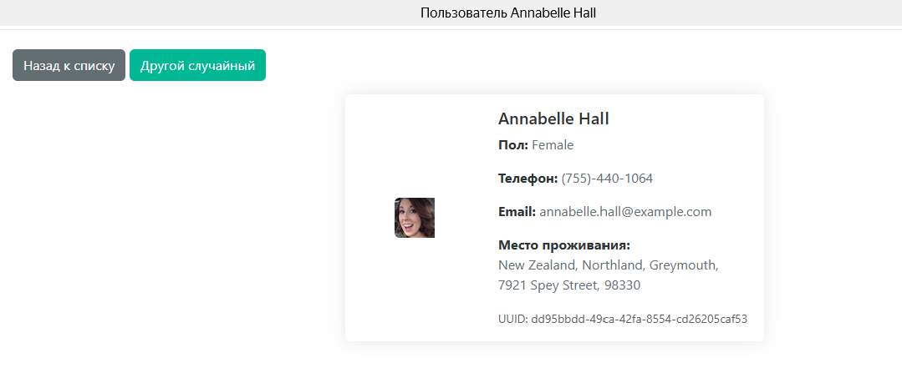

# Random User API Project

Проект представляет собой веб-приложение для работы с API Random User (https://randomuser.me/).

## Технологии

- **Django**: Выбран как основной веб-фреймворк из-за:
  - Встроенной админ-панели
  - ORM для удобной работы с базой данных
  - Системы шаблонов
  - Встроенной системы аутентификации
  - Большого количества готовых пакетов
  - Хорошей документации и большого сообщества

- **PostgreSQL**: Выбрана как база данных из-за:
  - Надежности и производительности
  - Поддержки сложных запросов
  - Хорошей интеграции с Django
  - Возможности масштабирования

## Установка

1. Создайте виртуальное окружение:
```bash
python -m venv venv
source venv/bin/activate  # для Linux/Mac
venv\Scripts\activate     # для Windows
```

2. Установите зависимости:
```bash
pip install -r requirements.txt
```

3. Примените миграции:
```bash
python manage.py migrate
```

4. Запустите сервер:
```bash
python manage.py runserver
```

## Функциональность

- Загрузка случайных пользователей из API
- Отображение списка пользователей с пагинацией
- Детальная информация о пользователе
- Получение случайного пользователя
- Автоматическая загрузка 1000 пользователей при старте сервера

## Скриншоты

### Главная страница

*Список пользователей с возможностью выбора количества и пагинацией*

### Страница пользователя

*Детальная информация о пользователе*

### Случайный пользователь

*Страница случайного пользователя с возможностью получить другого случайного пользователя*

## Тестирование

Для запуска тестов:
```bash
pytest
``` 